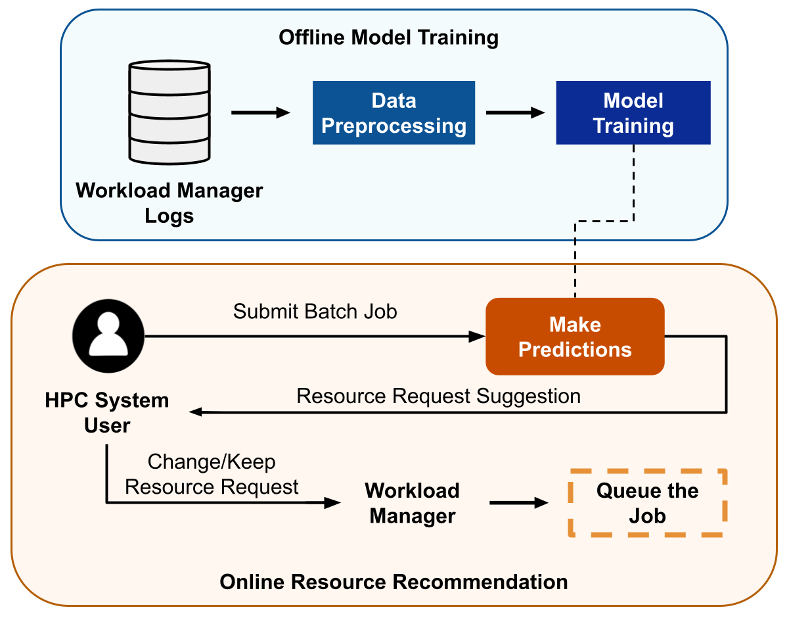

# 🚀 qsub_rec Module

<p align="center">
  
  
  
</p>

Boston University RCS Team collaboration for an intelligent resource prediction framework.  
This work has been **partially funded by Sandia National Laboratories**.

---

## 📘 Overview

The `qsub_rec` module is designed for intelligent resource prediction within collaborative HPC environments.  
It provides **training** and **prediction** scripts suitable for **batch job submissions** on the Boston University Shared Computing Cluster (BU SCC) system.

<p align="center">
  
</p>

---

## ✨ Features

- 🧹 Data preprocessing utilities  
- 📈 Regression-based prediction algorithms  
- 🛠️ Model training and prediction tools  

---

## 🧩 Installation & Training

On the **BU SCC** system, include the module directory and load the module:

```bash
module use /projectnb/peaclab-mon/boztop/module_files
module load qsub_rec/1.0.0
```

Train the model, once after module is loaded.

```bash
./train_rec.py
```

## 🔑 Usage
To generate a new script with the recommended number of processors for your batch job:

```bash
./sub_rec.py path_to_your_batch_job_file
```
A new script will be created in the same directory as your batch job file, with suggested resource requests based on the model prediction.


## 🛟 Support

For questions, issues or feedback, please contact [boztop@bu.edu](mailto:boztop@bu.edu).


